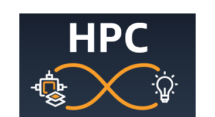

# AWSome HPC

The AWSome HPC repository is a collection of quickstart solutions to deploy and run various High Performance Computing (HPC) application on AWS using [AWS ParallelCluster](<https://aws.amazon.com/hpc/parallelcluster/>).
To make things easy, it provides the steps to build an Amazon Machine Images ([AMI](<https://docs.aws.amazon.com/AWSEC2/latest/UserGuide/AMIs.html>)) for the applications listed below, a baseline AWS ParallelCluster cluster configuration and a [Slurm](<https://www.schedmd.com/>) submission script with a test case to get started.

You want to learn more about HPC on AWS ? You can visit [https://www.hpcworkshops.com/](<https://www.hpcworkshops.com/>) that a series of workshop of AWS services for HPC.

## Applications on AWS ParallelCluster

The following quickstart are provided for the following applications:

- Molecular Dynamics
  - [Gromacs](<apps/gromacs/README.md>)
  - [LAMMPS](<apps/lammps/README.md>)
- Weather Simulation
  - [MPAS](<apps/mpas/README.md>)
  - [WRF v4](<apps/wrf/README.md>)
- Computational Fluid Dynamics (CFD)
  - [OpenFOAM](<apps/openfoam/README.md>)
  - [Barracuda](<apps/barracuda/README.md>)

# Repository Structure

The repository is organized as follow:

1. `apps` contains applications deployment scripts.
1. `scripts/install` contains compilers, libraries and applications installation scripts. There are targeted for Amazon Linux 2 and AWS ParallelCluster.
1. `ansible` contains ansible roles. As example, we provide a role to set linux system limits to run HPC workload.

## Security

See [CONTRIBUTING](<CONTRIBUTING.md#security-issue-notifications>) for more information.

## License

This project is licensed under MIT-0, see the [LICENSE](<LICENSE>) file
